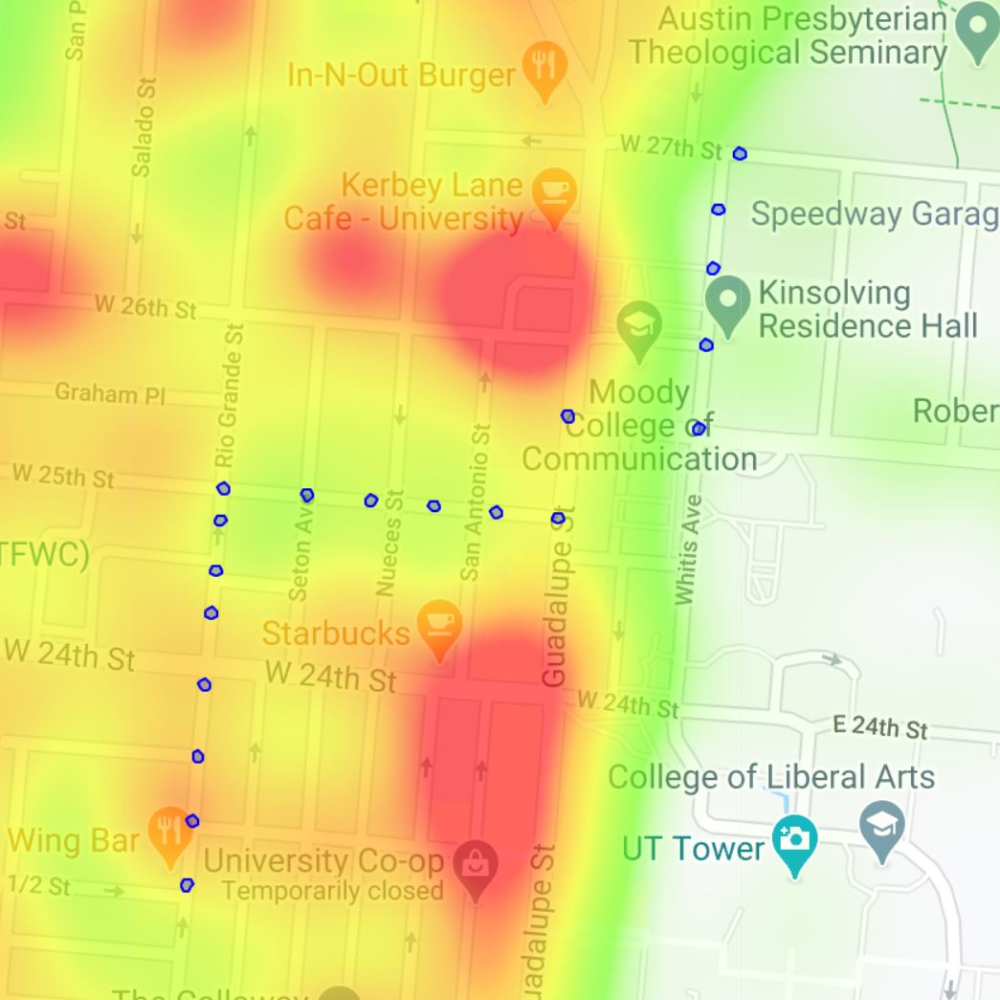

# roUTe - A safer way to travel around UT Austin

The area around the University of Texas at Austin has seen an uptick in crime in 
recent years. roUTe is a 
product idea I devised during Convergent's spring 2020 build season. The idea is to 
build a data-driven mobile application that optimizes walking routes for safety in 
the UT Austin area. This repository holds my code for a route optimization algorithm
I created that would drive the backend. My goal is to construct a mobile application
around this algorithm to deploy to UT students at some point in the next couple years.

## How it works
We start with a user location and destination. This information is fed into a 
waypoint generator. A waypoint is a latitude-longitude coordinate that a route is 
directed through. These waypoints are fed into the Google Maps Directions API 
and roUTe generates up to 15 unique routes. Then, roUTe extracts nodes from these routes,
calculates intermediate points between each node, and generates point routes. 
Each point in every point route is mapped to a latitude-longitude subregion, 
shown below as red circles. All crime data from the last 4 years is pulled from 
austin.gov using the Socrata Open Data API, each crime is weighted based on severity, 
and each sub-region is scored. Then, each point route is scored 90% based on the 
sub-regions it passes through and 10% based on route duration. 

